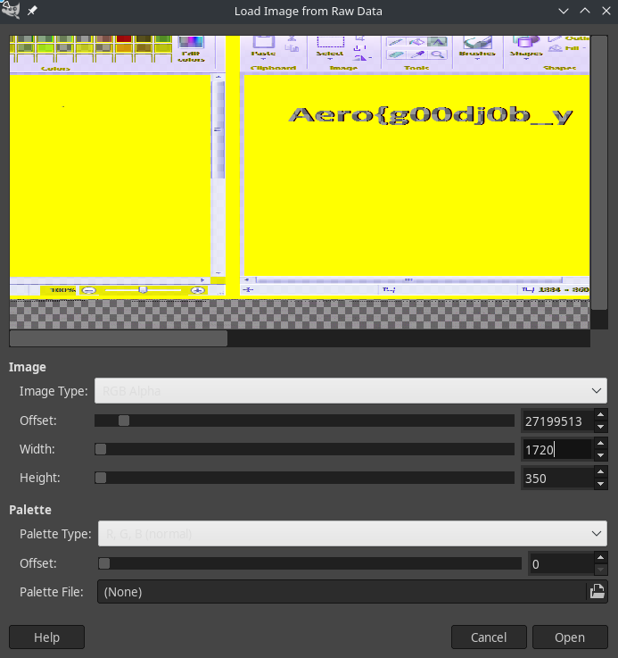
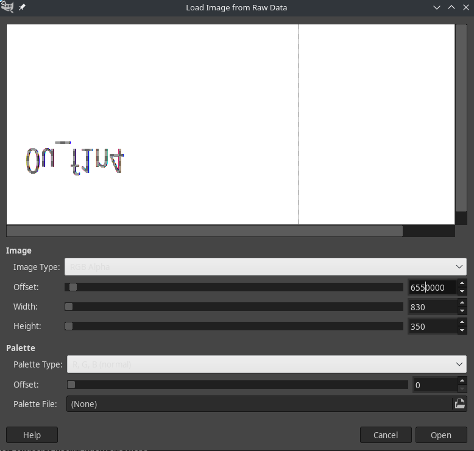
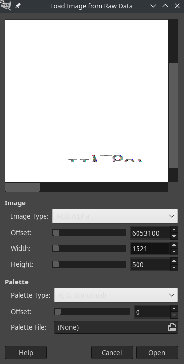

# AeroCTF 2020 Drawings on the wall

## Problem

My friend started having problems with his head and he began to draw some nonsense on the walls.

Can you make out these notes?

[Download](https://mega.nz/#!WJ4mGaBB!tW9Ls1Zlx-LBhUiEqVfWajUqTy9UT5lJk44jYqvBx_w)

## Solution

Download the file from the link above, extract it and we're left with a file called `memory.dmp`

Using the `file` command, let's find out what it is:
```bash
$  file memory.dmp 
memory.dmp: MS Windows 64bit crash dump, full dump, 524288 pages
```

Seems like it's a Windows crash dump, we can use the tool [volatility](https://github.com/volatilityfoundation/volatility) to help us analyze this dump file.

Let's figure out which processes were running.

```bash
$ vol.py -f memory.dmp --profile=Win7SP1x64 pslist
Volatility Foundation Volatility Framework 2.6.1
Offset(V)          Name                    PID   PPID   Thds     Hnds   Sess  Wow64 Start                          Exit                          
------------------ -------------------- ------ ------ ------ -------- ------ ------ ------------------------------ ------------------------------
0xfffffa80018c8740 System                    4      0    101      411 ------      0 2020-02-24 14:27:25 UTC+0000                                 
0xfffffa8003e077c0 smss.exe                272      4      2       30 ------      0 2020-02-24 14:27:25 UTC+0000                                 
0xfffffa8003407b30 csrss.exe               364    340     10      547      0      0 2020-02-24 14:27:27 UTC+0000                                 
0xfffffa80036217e0 wininit.exe             408    340      3       73      0      0 2020-02-24 14:27:28 UTC+0000                                 
0xfffffa8003da1420 csrss.exe               428    416     11      307      1      0 2020-02-24 14:27:28 UTC+0000                                 
0xfffffa8003054700 services.exe            472    408     11      225      0      0 2020-02-24 14:27:28 UTC+0000                                 
0xfffffa800402e7c0 lsass.exe               496    408      7      715      0      0 2020-02-24 14:27:28 UTC+0000                                 
0xfffffa800404db30 lsm.exe                 512    408     10      157      0      0 2020-02-24 14:27:28 UTC+0000                                 
0xfffffa800406eb30 winlogon.exe            520    416      4      124      1      0 2020-02-24 14:27:28 UTC+0000                                 
0xfffffa80040fd3c0 svchost.exe             636    472     12      365      0      0 2020-02-24 14:27:28 UTC+0000                                 
0xfffffa8004117b30 vmacthlp.exe            696    472      3       55      0      0 2020-02-24 14:27:28 UTC+0000                                 
0xfffffa800412bb30 svchost.exe             740    472     14      314      0      0 2020-02-24 14:27:29 UTC+0000                                 
0xfffffa8004155b30 svchost.exe             788    472     17      490      0      0 2020-02-24 14:27:29 UTC+0000                                 
0xfffffa8004181420 svchost.exe             884    472     18      410      0      0 2020-02-24 14:27:29 UTC+0000                                 
0xfffffa800418b3a0 svchost.exe             908    472     46     1016      0      0 2020-02-24 14:27:29 UTC+0000                                 
0xfffffa8004211890 svchost.exe             376    472     15      613      0      0 2020-02-24 14:27:29 UTC+0000                                 
0xfffffa800427f5f0 svchost.exe             940    472     16      512      0      0 2020-02-24 14:27:29 UTC+0000                                 
0xfffffa80042d2910 spoolsv.exe            1128    472     13      289      0      0 2020-02-24 14:27:29 UTC+0000                                 
0xfffffa80042d9b30 svchost.exe            1164    472     21      348      0      0 2020-02-24 14:27:29 UTC+0000                                 
0xfffffa800435ab30 taskhost.exe           1276    472      8      190      1      0 2020-02-24 14:27:30 UTC+0000                                 
0xfffffa8004392b30 dwm.exe                1360    884      5      148      1      0 2020-02-24 14:27:30 UTC+0000                                 
0xfffffa80043a5b30 explorer.exe           1392   1332     29      871      1      0 2020-02-24 14:27:30 UTC+0000                                 
0xfffffa80043ffb30 svchost.exe            1460    472     15      217      0      0 2020-02-24 14:27:30 UTC+0000                                 
0xfffffa80044a7b30 VGAuthService.         1556    472      3       87      0      0 2020-02-24 14:27:30 UTC+0000                                 
0xfffffa8004481b30 vmtoolsd.exe           1636    472     10      283      0      0 2020-02-24 14:27:30 UTC+0000                                 
0xfffffa8004572720 vmtoolsd.exe           1904   1392      8      202      1      0 2020-02-24 14:27:31 UTC+0000                                 
0xfffffa80045d8420 svchost.exe            2000    472      6       94      0      0 2020-02-24 14:27:31 UTC+0000                                 
0xfffffa800461e5b0 dllhost.exe             876    472     14      198      0      0 2020-02-24 14:27:33 UTC+0000                                 
0xfffffa80040666a0 msdtc.exe              2144    472     12      148      0      0 2020-02-24 14:27:34 UTC+0000                                 
0xfffffa80046e2b30 WmiPrvSE.exe           2360    636     10      229      0      0 2020-02-24 14:27:35 UTC+0000                                 
0xfffffa800475c750 SearchIndexer.         2452    472     14      648      0      0 2020-02-24 14:27:37 UTC+0000                                 
0xfffffa8004946060 sppsvc.exe             2692    472      5      157      0      0 2020-02-24 14:29:31 UTC+0000                                 
0xfffffa80047b43c0 svchost.exe            2640    472     14      337      0      0 2020-02-24 14:29:31 UTC+0000                                 
0xfffffa8001b625b0 firefox.exe            1240    372      0 --------      1      0 2020-02-24 14:33:58 UTC+0000   2020-02-24 14:40:30 UTC+0000  
0xfffffa8001ca8b30 notepad++.exe          2836   3764      7      130      1      0 2020-02-24 14:39:32 UTC+0000                                 
0xfffffa8001a5f060 mspaint.exe            2080   1392      7      146      1      0 2020-02-28 14:50:41 UTC+0000                                 
0xfffffa8001ca3060 svchost.exe            3644    472      7      109      0      0 2020-02-28 14:50:41 UTC+0000                                 
0xfffffa8001cbab30 mspaint.exe            2804   1392      7      132      1      0 2020-02-28 15:12:05 UTC+0000                                 
0xfffffa8001dd8b30 mspaint.exe            3416   1392      6      128      1      0 2020-02-28 15:12:07 UTC+0000                                 
0xfffffa800274d060 mspaint.exe             704   1392      6      129      1      0 2020-02-28 15:12:09 UTC+0000                                 
0xfffffa8001bfe060 mspaint.exe            2964   1392      6      130      1      0 2020-02-28 15:14:03 UTC+0000                                 
0xfffffa8002098060 mspaint.exe            2124   1392      6      129      1      0 2020-02-28 15:14:28 UTC+0000                                 
0xfffffa8001c36060 svchost.exe            3504    472      5       65      0      0 2020-02-29 01:15:26 UTC+0000                                 
0xfffffa8001df3060 LogonUI.exe             736    520      8      172      1      0 2020-02-29 01:21:06 UTC+0000  
```

Since this challenge mentioned drawings, let's dump all those `mspaint.exe` processes.

```bash
$ vol.py -f memory.dmp --profile=Win7SP1x64  memdump -p 2804 -D dumpedfiles/
Volatility Foundation Volatility Framework 2.6.1
************************************************************************
Writing mspaint.exe [  2804] to 2804.dmp
$ vol.py -f memory.dmp --profile=Win7SP1x64  memdump -p 2080 -D dumpedfiles/   
Volatility Foundation Volatility Framework 2.6.1
************************************************************************
Writing mspaint.exe [  2080] to 2080.dmp
$ vol.py -f memory.dmp --profile=Win7SP1x64  memdump -p 3416 -D dumpedfiles/         
Volatility Foundation Volatility Framework 2.6.1
************************************************************************
Writing mspaint.exe [  3416] to 3416.dmp
$ vol.py -f memory.dmp --profile=Win7SP1x64  memdump -p 704 -D dumpedfiles/    
Volatility Foundation Volatility Framework 2.6.1
************************************************************************
Writing mspaint.exe [   704] to 704.dmp
$ vol.py -f memory.dmp --profile=Win7SP1x64  memdump -p 2964 -D dumpedfiles/   
Volatility Foundation Volatility Framework 2.6.1
************************************************************************
Writing mspaint.exe [  2964] to 2964.dmp
$ vol.py -f memory.dmp --profile=Win7SP1x64  memdump -p 2124 -D dumpedfiles/    
Volatility Foundation Volatility Framework 2.6.1
************************************************************************
Writing mspaint.exe [  2124] to 2124.dmp
```

Rename all these files from `*.dmp` to `*.data` so we can open it in GIMP.







## Flag

`Aero{g00dj0b_y0u_f1n411y_g07_7h3_wh0l3_fl4g}`