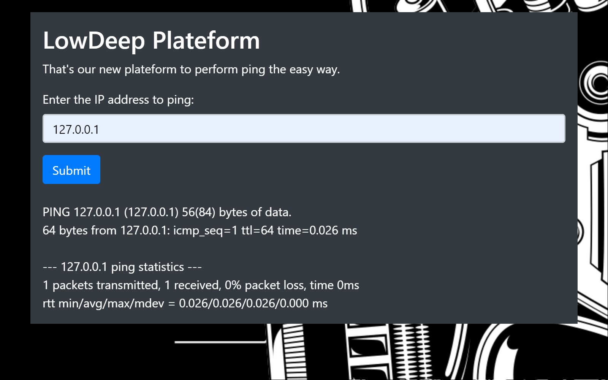
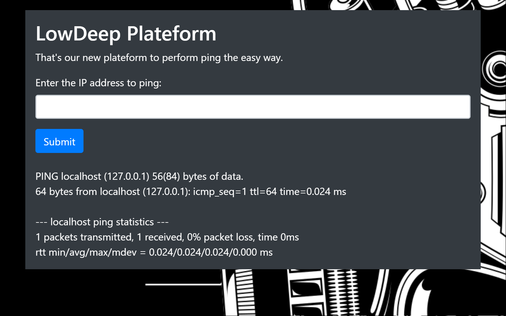
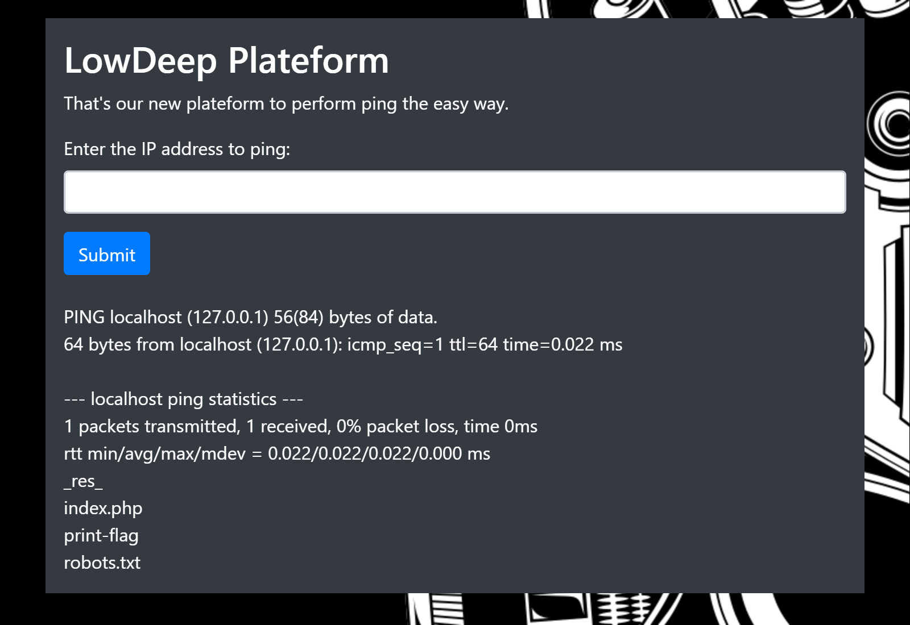

# INSCTF20Q LowDeep

## Challenge

Try out our new ping platform: [http://lowdeep.insomnihack.ch](http://lowdeep.insomnihack.ch). (Note: Only works with HTTP)

## Solution





Interesting, it allows ips and hostnames. It behaves like ping itself. Maybe we need to try a Remote Code Execution attack here.

Let's see if it attempts to interpret other commands with: `localhost;ls`




Unfortunately, we can't just use `cat`.


So let's visit the page instead: [http://lowdeep.insomnihack.ch/print-flag](http://lowdeep.insomnihack.ch/print-flag)

And we get the following file: 

```bash
$ file print-flag
print-flag: ELF 64-bit LSB shared object, x86-64, version 1 (SYSV), dynamically linked, interpreter /lib64/l, for GNU/Linux 3.2.0, BuildID[sha1]=72c589834f878a6a3267944f305c29166a1ace8b, stripped
$ chmod +x print-flag
$ ./print-flag
INS{Wh1le_ld_k1nd_0f_forg0t_ab0ut_th3_x_fl4g}
```

## Flag

`INS{Wh1le_ld_k1nd_0f_forg0t_ab0ut_th3_x_fl4g}`